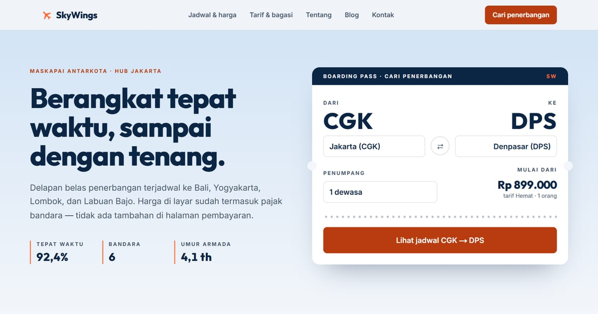

# SkyWings — Maskapai Antarkota yang Tepat Waktu

SkyWings terbang dari Jakarta ke Bali, Yogyakarta, Lombok, dan Labuan Bajo. Jadwal dengan jam setempat, tarif dalam Rupiah sudah termasuk pajak, dan angka ketepatan waktu tiap bulan.

**Demo live:** https://landing-skywings.vercel.app



> Template landing page untuk maskapai fiktif. Bandara yang disebut adalah bandara sungguhan; nomor penerbangan, harga, dan angka ketepatan waktu adalah contoh. Formulir hanya demo dan tidak mengirim data.

## Konsep

Bahasa rupa **Boarding Pass**: tepi berlubang, kode bandara tiga huruf, jam dalam angka rata, dan garis sobek. Dilengkapi blog dengan enam artikel perjalanan.

## Halaman

- `/` — formulir cari penerbangan berbentuk boarding pass, papan keberangkatan CGK, empat rute berfoto, tiga tarif, grafik ketepatan waktu, FAQ, cuplikan blog
- `/jadwal` — 18 penerbangan dengan saringan asal/tujuan/hari; jam tiba dihitung dari durasi + zona waktu (WIB/WITA)
- `/layanan` — tabel perbandingan tarif, check-in & gerbang, layanan khusus
- `/tentang` — armada & prinsip (angka dihitung dari data)
- `/kontak` — formulir bantuan dengan kode pemesanan
- `/blog`, `/blog/[slug]` — enam artikel perjalanan, dirender di server
- `/about`, `/services`, `/contact` — dialihkan (308) ke halaman berbahasa Indonesia

## Teknologi

- Next.js 15.5 (App Router) dan React 19
- Tailwind CSS v4
- JavaScript
- Papan keberangkatan, jadwal, dan grafik dibuat dengan React + CSS (tanpa pustaka grafik/animasi)
- Font: Outfit, Inter (next/font)
- SEO: metadata per halaman, Open Graph, JSON-LD, sitemap.xml, dan robots.txt

## Menjalankan secara lokal

```bash
npm install
npm run dev
```

Buka http://localhost:3000. Untuk build produksi: `npm run build` lalu `npm start`.

## Kredit foto

Semua foto berlisensi **CC0 (domain publik)** dari rawpixel, Wikimedia Commons, dan StockSnap; dipotong dan diperkecil. Pesawat di foto bukan milik SkyWings.

- `public/images/rute/bali.webp` — "Free Bali temple lake view" ([sumber](https://www.rawpixel.com/image/5916690/image-public-domain-water-free))
- `public/images/rute/yogyakarta.webp` — "Free Prambanan Temple image" ([sumber](https://www.rawpixel.com/image/5904361/photo-image-public-domain-free-travel))
- `public/images/rute/lombok.webp` — "Beach in Lombok 8" oleh Lasthib ([sumber](https://commons.wikimedia.org/w/index.php?curid=52365842))
- `public/images/rute/labuan-bajo.webp` — "Labuan bajo" oleh Lasthib ([sumber](https://commons.wikimedia.org/w/index.php?curid=52364027))
- `public/images/rute/pesawat-gerbang.webp` — "Airplane Loading" oleh World Travel Adventures ([sumber](https://stocksnap.io/photo/airplane-loading-DDSTKU4W97))
- `public/images/rute/ruang-tunggu.webp` — "Airport Terminal" oleh Matt Moloney ([sumber](https://stocksnap.io/photo/airport-terminal-CTIWBOSEN7))

---

Bagian dari koleksi 17 template landing page di [PortalLanding](https://portal-landing-seven.vercel.app). Dibuat oleh [PintuWeb](https://pintuweb.com), jasa pembuatan website.
